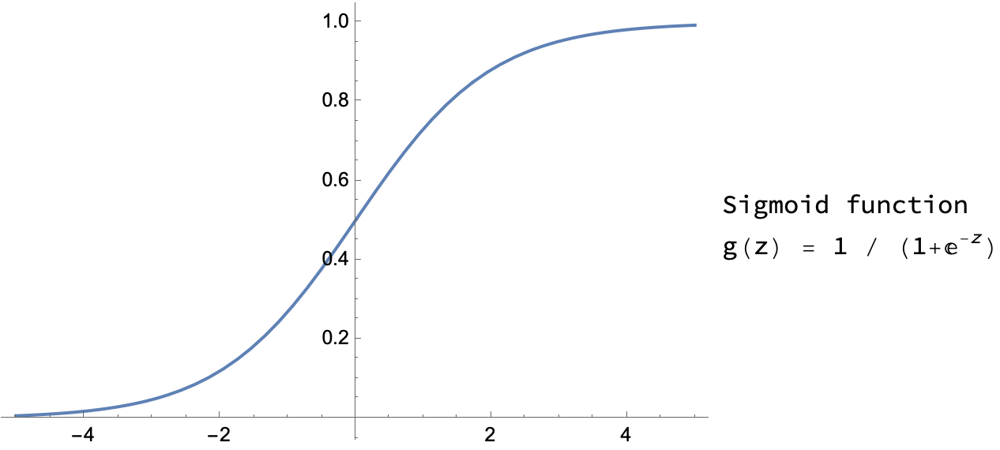
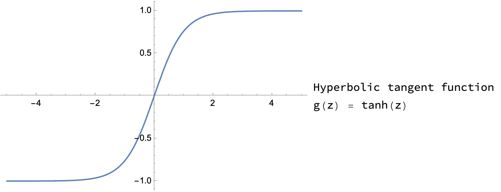
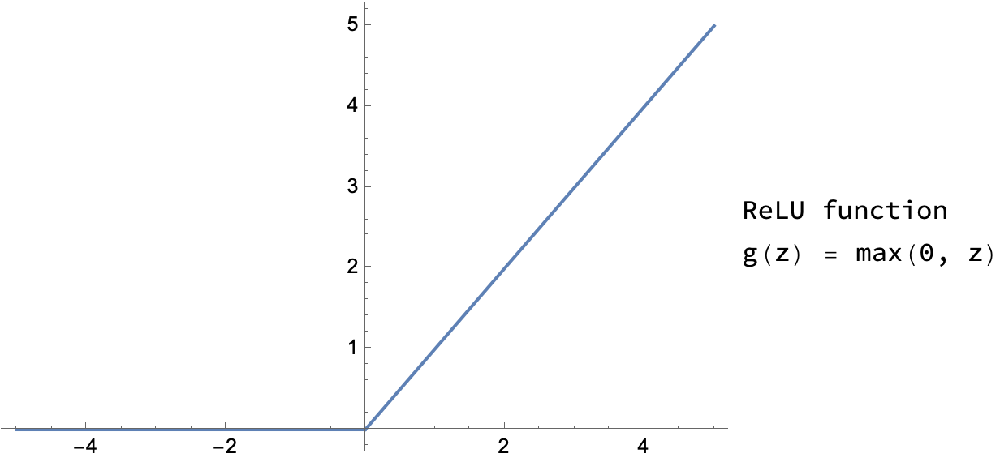
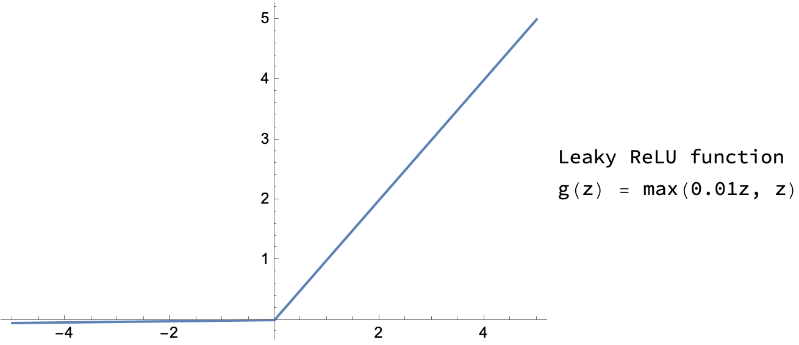

## Neural network

- 第一个输入样本值的层称为**输入层**
- 中间层也称为**隐藏层**（中间层可以有很多层）
- 最后一个神经网络层也叫**输出层**

每一层的输出值也叫**激活值** (activation values)

[Neural Network Layer](../MachineLearning2022/Week%2004%20Neural%20Networks.md#Neural%20Network%20Layer)

每一个神经元有参数 $\vec{w}_i$ 和 $b_i$ ，它的作用是输出一些激活值 $a_i = g(\vec{w}_i \cdot \vec{x} + b_i)$ ，该层的神经元的激活值 $a_1, a_2, \dots, a_k$（ $k$ 为该层神经元的个数）组成输出值向量，传入下一层。

以后统一用上标 (^\[n]) 表示第 $n$ 层。输入层为第 0 层，中间的隐藏层从第 1 层开始进行标注。例如，对于隐藏层第 1 层的第 2 个神经元，其参数为 $\vec{w}_2^{[1]}$ 和 $b_2^{[1]}$ ，其输出的激活值为 $a_2^{[1]} = g(\vec{w}_2^{[1]} \cdot \vec{a}^{[0]} + b_2^{[1]})$ ，隐藏层第 1 层的激活值为 $a^{[1]}$ 等等

## Activation functions 激活函数

$a_i = g(\vec{w}_i \cdot \vec{x} + b_i)$ 中的 $g()$ 函数即为 activation function

activation function 可选的有很多：
- Sigmoid function 
$$g(z) = \frac{1}{1 + e^{-z}}$$


Suitable for **Binary classification**

- Hyperbolic tangent function 
$$g(z) = \tanh(z)$$


Compared to Sigmoid function, the hyperbolic tangent function has the effect of **centering** the data which means the average of the date is closer to $0$ .

- ReLU function 
$$g(z) = \max(0, z)$$


Compared to the two functions, the ReLU function avoids the downside that if $z$ is either very large or very small, then the gradient or the derivative or the slope of the function becomes very small, ending up being close to $0$ , which would slow down gradient descent.

- Leaky ReLU function 
$$g(z) = \max(0.01z, z)$$


Compared to the ReLU function, the slope of Leaky ReLU function is not $0$ when $z < 0$

总结选择 activation function 的原则：
- 如果输出为 0 或 1，即在使用二元分类，则输出层选择 Sigmoid function，其他隐藏层的 units 选择 ReLU function
- 其他情况下，hyperbolic tangent function 要优于 Sigmoid function
- 有时可以用 Leaky ReLU function 代替 ReLU function

### Why non-linear activation function？

[Why do we need activation function?](../MachineLearning2022/Week%2005%20Neural%20network%20training.md#Why%20do%20we%20need%20activation%20function?)

units 中没有 activation function 也可认为引入了一个 linear activation function: 
$$g(z) = z$$

激活函数的作用是**非线性输出**，如果没有激活函数，所有的神经元做的只是线性变换，则只能应对线性回归模型，且整个神经网络与只用一个神经元本质上没有区别（因为矩阵乘法）。

隐藏层中坚决不要使用 linear activation function （建议使用 ReLU function）

### Derivative of activation function

- Sigmoid function 
$$
\begin{aligned}
g(z) &= \frac{1}{1 + e^{-z}} \\
\frac{d}{dz} g(z) &= \frac{1}{1 + e^{-z}} \left(1 - \frac{1}{1 + e^{-z}}\right) = g(z) \left(1 - g(z)\right)
\end{aligned}
$$
- Hyperbolic tangent function
$$
\begin{aligned}
g(z) &= \tanh(z) \\
\frac{d}{dz} g(z) &= 1- \left(\tanh(z)\right)^2 = 1- \left(g(z)\right)^2
\end{aligned}
$$
- ReLU 和 Leaky ReLU function 的导数非常简单，这里不再直接给出

## Gradient descent for Neural networks

通过 Backward Pass 分别计算出 ${dJ} / {dw^{[l]}}$ 和 ${d J} / {d b^{[l]}}$ ，其中 $\vec{w}^{[l]}$ 和 $b^{[l]}$ 为神经网络第 $l$ 层的参数，然后通过 Gradient descent 
$$
\begin{align*}
w^{[l]} &= w^{[l]} - \alpha * \frac{\partial}{\partial w^{[l]}} J(w, b) \\
b^{[l]} &= b^{[l]} - \alpha * \frac{\partial}{\partial b^{[l]}} J(w, b)
\end{align*}
$$
对所有的参数进行更新

## Random Initialization of weights

把神经网络的权重参数全部初始化为 0 并使用 Gradient descent 将无法获得预期的效果。
由于无论输入为多少，初始化为 0 的 $w$ 和 $b$ 都将其变为 0 ，即输出值具有对称性，会导致训练出的神经网络同一层中的 units 所有的参数都是一样的，即该层等于某一个 unit 复制了很多份形成一层。

在初始化时，通常使用
```python
w_l = np.random.randn(n_in_l, n_out_l) * 0.01
b_l = np.zeros((n_out_l, 1))
```
对 $w$ 和 $b$ 进行初始化，其中 `n_in_l` 和 `n_out_l` 决定了参数的维度。

然后计算 $a^{[l]} = g((w^{[l]})^T a^{[l-1]} + b^{[l]})$ 
其中
- $\text{dim}[w^{[l]}] = n_{in}^{[l]} \times n_{out}^{[l]}$ 
- $\text{dim}[b^{[l]}] = n_{out}^{[l]} \times 1$
- $\text{dim}[a^{[l-1]}] = n_{out}^{[l-1]} \times m = n_{in}^{[l]} \times m$  m 个数据列向量按行堆叠成 m 行矩阵
- $\text{dim}[a^{[l]}] = n_{out}^{[l]} \times m$   m 个数据列向量按行堆叠成 m 行矩阵
所以有 
$$
\begin{aligned}
\text{dim}[g((w^{[l]})^T a^{[l-1]} + b^{[l]})] &= \text{dim}[(w^{[l]})^T a^{[l-1]} + b^{[l]}] \\ 
&= (n_{out}^{[l]} \times n_{in}^{[l]}) * (n_{in}^{[l]} \times m) + n_{out}^{[l]} \times 1 \\
\text{(Python broadcast) } &= (n_{out}^{[l]} \times n_{in}^{[l]}) * (n_{in}^{[l]} \times m) + n_{out}^{[l]} \times m \\
&= n_{out}^{[l]} \times m + n_{out}^{[l]} \times m \\
&= n_{out}^{[l]} \times m \\
&= \text{dim}[a^{[l]}]
\end{aligned}
$$
其中 $a^{[0]} = x = \left[x^{(1)}, x^{(2)}, \cdots, x^{(m)}\right]$ 为输入矩阵

最后会得到 $1 \times m$ 的预测值向量 $\hat{y}$

注：虽然我们不将神经网络的参数设置为 0 ，但是我们更加青睐较小的随机值，这也是为什么我们在取到 $w$ 的随机值后还要乘上 0.01 的系数。原因是选取的 activation function 中，Sigmoid 和 Hyperbolic tangent function 在 0 附近梯度较大，在梯度下降时学习速度更快，更加容易收敛到理想的值